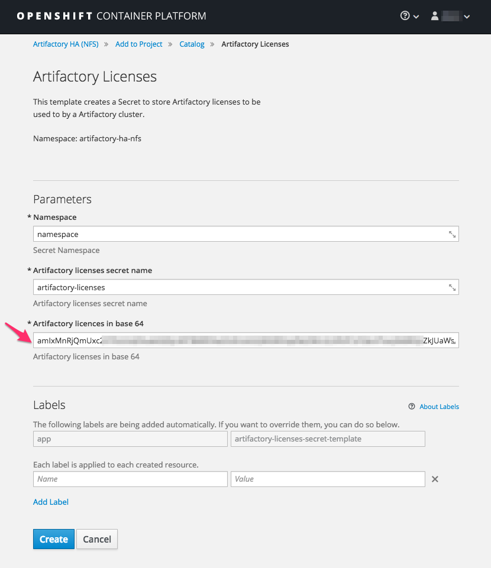
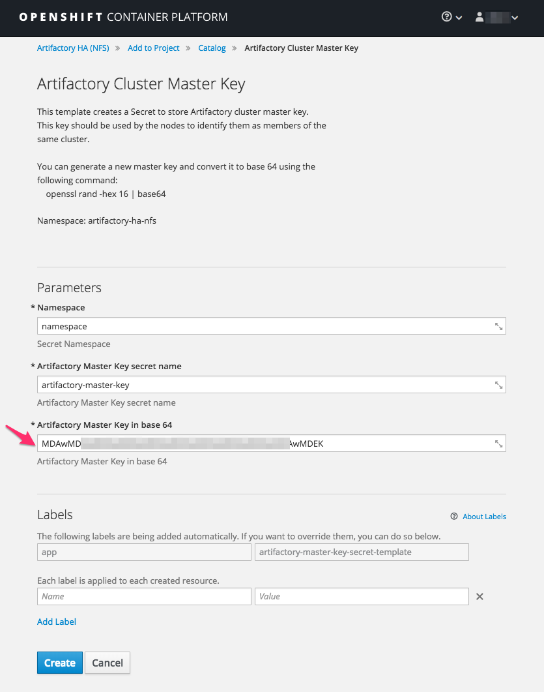
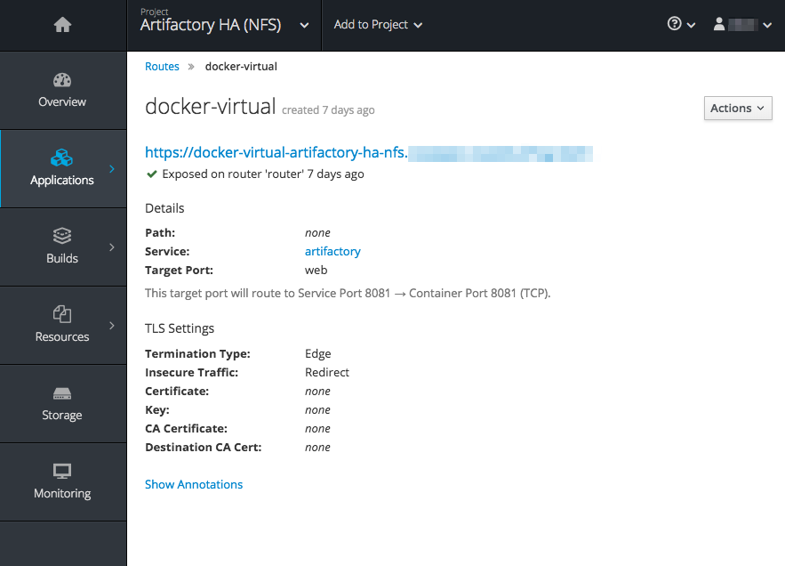
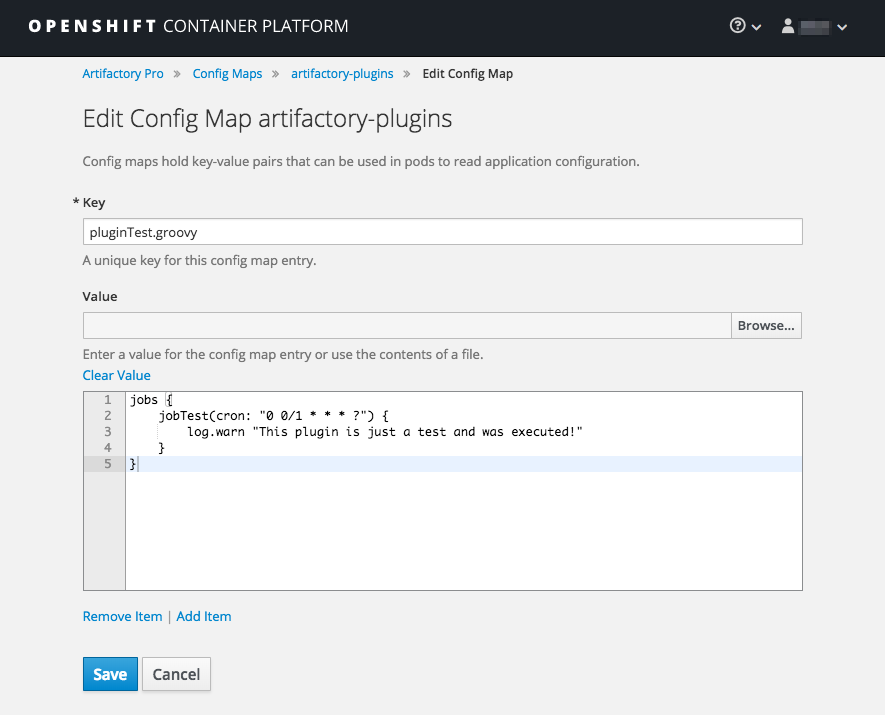

# Artifactory HA templates for Openshift Container Platform #

These templates can be used to deploy Artifactory HA on Openshift Container Platform.

You can find two sets of templates on this repository. `artifactory-ha-nfs` set should be used when you have a NFS server available and want to have shared data folders on your Artifactory nodes. If you do not have or do not intend to use NFS, `artifactory-ha-no-nfs` set must be used.

These templates have been tested with Artifactory 5.8.x and Openshift 3.6 running on a single node. To process the templates using the provided helper scripts, Openshift CLI 3.7.17 or newer is required.

# Installing templates #

To install the templates use the provided `install.sh` script present on the template set folder.
```
oc login -u <user> -p <password> <host>
oc project <namespace>
chmod +x ./install.sh
./install.sh -o create
```

You can install the templates on `openshift` namespace to make them available to all namespaces in the cluster.

To update the templates use:
```
./install.sh -o replace
```

To remove the templates use:
```
./install.sh -o delete
```

# Usage #

## Deploy database service ##

Artifactory HA needs a dedicated database service. To see the list of supported databases visit [Configuring the Database](https://www.jfrog.com/confluence/display/RTF/Configuring+the+Database) Artifactory wiki page.

### Using the provided PostgreSQL templates ###

Besides Artifactory HA templates, this repository has a PostgreSQL template set at `database/postgresql` that can be used to install a PostgreSQL instance to be used by your Artifactory cluster.

To do so, execute the following steps:

- Install the templates by going to the templates folder and using the following command:
```
chmod +x ./install.sh
./install.sh -o create
```

#### Create service account ####

PostgreSQL docker image needs root access. One way to provide that is running the pods using an Openshift Service Account asociated to a Security Context Constraint (scc) that can run container as any user. Openshift Container Platform has a built in scc called `anyuid` that can be used, or you can create your own scc to be used with your Service Account.

To create a Service Account and grant it the desired scc use the following commands:

```
oc project <NAMESPACE>
oc create serviceaccount <SERVICE_ACCOUNT_NAME>
oc adm policy add-scc-to-user <SCC_NAME> -z <SERVICE_ACCOUNT_NAME>
```

#### Usage ####

- Create a basic authentication Secret to store the PostgreSQL credentials. You can create this Secret through the Secrets UI or using the provided `postgresql-secret-template`. This Secret is going to be used by both PostgreSQL templates and Artifactory HA templates.

- Make sure you have a Persistent Volume available to be used by the PostgreSQL service.

- Create a parameters file to store information about the PostgreSQL service. You can use provided `sample-params.env` file as a reference.

The required parameters are:

| Parameter Name | Description | Default Value | Must Exist |
| ---- | ---- | ---- | ---- |
| NAME | PostgreSQL service identifier | postgresql | |
| NAMESPACE | Namespace where you want this service to be executed | | Yes |
| SERVICE_ACCOUNT | Service account to be used by the Pod | | Yes |
| POSTGRESQL_PVC_NAME | PostgreSQL service PVC identifier | postgresql | |
| POSTGRESQL_PVC_SIZE | PostgreSQL PVC size | 10Gi | |
| POSTGRESQL_SECRET_NAME | Secret containing the credentials to be used | postgresql_credentials | Yes |
| POSTGRESQL_DATABASE | Database name | artifactory | |
| INIT_CONTAINER_IMAGE | Docker Image to be used by the init container | busybox | |

- Process templates and create objects using the following command:

```
chmod +x ./process.sh
./process.sh -p <PARAMETERS_FILE_PATH> -o create
```

### Adding support to different databases ###

Artifactory already comes with the JDBC driver for PostgreSQL. If you intend to use a different database, you need to provide the additional JDBC driver to Artifactory.

In order to do that, you can use a init-container sidecar that has the JDBC driver inside it and use a shared mount point between this init-container and Artifactory container to make the driver available. Also, you need to override Artifactory entrypoint to move the JDBC driver to the expected location under `$ARTIFACTORY_HOME/tomcat/lib`.

To create a docker image containing the additional JDBC driver you can download the JDBC driver from the official source and use the following Dockerfile:
```
FROM busybox:latest
ADD <JDBC_DRIVER_PATH>
```

To use it as a init-container, add the following code before the `container` entry to both `artifactory-primary-deployment.yaml` and `artifactory-secondary-deployment.yaml` templates under the Artifactory HA templates set folder you want to use (NFS or No NFS).
```
initContainers:
  - name: additional-jdbc-driver-provider
    image: <PATH_TO_YOUR_IMAGE>
    command: ["sh", "-c", "cp -fv <JDBC_DRIVER_PATH> /var/opt/jfrog/artifactory"]
    volumeMounts:
      - name: artifactory-data
        mountPath: /var/opt/jfrog/artifactory
```

If you do not want or cannot create and serve a new Docker image, but have a place to serve the additional JDBC driver through HTTP, you can use the following as an alternative:
```
initContainers:
  - name: additional-jdbc-driver-provider
    image: ${ARTIFACTORY_IMAGE_REPOSITORY}:${ARTIFACTORY_VERSION}
    command: ["sh", "-c", "curl <JDBC_URL> -o /var/opt/jfrog/artifactory/<JDBC_DRIVER_FILENAME>"]
    volumeMounts:
      - name: artifactory-data
        mountPath: /var/opt/jfrog/artifactory
```

To override Artifactory entrypoint and move the new JDBC to the right location before starting Artifactory, you need to add the following attribute to the `container` entry on both `artifactory-primary-deployment.yaml` and `artifactory-secondary-deployment.yaml`:
```
command: ["sh", "-c", "mv -fv /var/opt/jfrog/artifactory/<JDBC_DRIVER_FILENAME> /opt/jfrog/artifactory/tomcat/lib && /entrypoint-artifactory.sh"]
```

## Create Persistent Volumes ##

Before deploying Artifactory nodes, make sure you have Persistent Volumes (PV) or a Dynamic Provisioner available for the following Persistent Volume Claims (PVC).

| Name | Access Mode | Description |
| ---- | ---- | ---- |
| ${NAME}-primary | ReadWriteOnce | Primary node files (application, configuration and logs) |
| ${NAME}-secondary | ReadWriteOnce | Secondary node files (application, configuration and logs) |

If you intend to use **NFS**, you also going to need Persistent Volumes for the following PVCs:

| Name | Access Mode | Description |
| ---- | ---- | ---- |
| ${NAME}-data | ReadWriteMany | Shared mount containing artifacts data |
| ${NAME}-backup | ReadWriteMany | Shared mount containing backup data |

**Note: Artifactory runs with UID `1030` and requires this user to be the owner of the volumes mount point. The deployment templates have init-containers in place to set the ownership of the volumes properly before starting Artifactory container.**

## Create Artifactory Licenses Secret ##

To create a Secret containing your Artifactory licenses you can use the provided template `artifactory-licenses-secret-template`.

You first need to convert your licenses to base 64. To do so, first create a file containing all your Artifactory licenses separated by an empty line, then run the following command:
```
cat <LICENSES_FILE> | base64
```

Use the above command output as the input of `ARTIFACTORY_LICENSES_BASE_64` parameter on `artifactory-licenses-secret-template` template.



## Create Artifactory Cluster Master Key Secret ##

The Artifactory Master key is used to identify members of the same cluster. Only Artifactory nodes sharing the same Master key can join a cluster. For more information about the Master key visit the [HA Installation and Setup](https://www.jfrog.com/confluence/display/RTF/HA+Installation+and+Setup) Artifactory wiki page.

To create a Secret containing the Master key you can use the provided template `artifactory-master-key-secret-template`.

To use this template, first you need to create a Master key and convert it to base 64. To do it use the following commands:
```
openssl rand -hex 16 > master.key
cat master.key | base64
```

Use the above command output as the input of `ARTIFACTORY_MASTER_KEY_BASE_64` parameter on `artifactory-master-key-secret-template` template.



## Create Parameters file ##

Create a parameters file to store the information about your Artifactory HA Service. You can use the provided `sample-params.env` as a reference.

The required parameters are:

| Parameter Name | Description | Default Value | Must Exist |
| ---- | ---- | ---- | ---- |
| NAME | Artifactory cluster identifier | | |
| NAMESPACE | Namespace where you want this cluster to be executed | | Yes |
| SERVICE_ACCOUNT | Service account to be used by the Pods. Must exists before execution. | | Yes |
| LICENSES_SECRET_NAME | Artifactory licenses Secret name. Must exists before execution. | | Yes |
| MASTER_KEY_SECRET_NAME | Artifactory Master key Secret name. Must exists before execution. | | Yes |
| BINARYSTORE_CONFIG_MAP_NAME | Artifactory binarystore.xml ConfigMap identifier | | |
| DATABASE_CONFIG_MAP_NAME | Database configuration ConfigMap identifier | | |
| DATABASE_CREDENTIALS_SECRET_NAME | Database credentials Secret | | Yes |
| DATABASE_TYPE | Database type | | |
| DATABASE_HOST | Database service hostname | | |
| DATABASE_PORT | Database service port | | |
| ARTIFACTORY_IMAGE_STREAM_NAME | Artifactory Docker ImageStream identifier | | |
| ARTIFACTORY_IMAGE_REPOSITORY | Artifactory Docker image repository | jfrog-docker-reg2.bintray.io/jfrog/artifactory-pro | |
| ARTIFACTORY_VERSION | Artifactory Docker image tag | 5.8.3 | |
| INIT_CONTAINER_IMAGE | Init-containers docker image | alpine:3.6 | |
| ARTIFACTORY_PVC_SIZE | Artifactory node PVC size | 20Gi | |
| CPU_REQUEST | Amount of CPU resources requested | 500m | |
| CPU_LIMIT | CPU resources usage limit | 1 | |
| MEMORY_REQUEST | Amount of Memory resources requested | 2Gi | |
| MEMORY_LIMIT | Memory resources usage limit | 3G1 | |
| ARTIFACTORY_EXTRA_JAVA_OPTIONS | Artifactory additional JVM options | -Xms1g -Xmx2g | |

If you intend to use the **NFS** version you also need to provide the following parameters:

| Parameter Name | Description | Default Value | Must Exist |
| ---- | ---- | ---- | ---- |
| ARTIFACTORY_DATA_PVC_SIZE | Shared data folder PVC size | 20Gi | |
| ARTIFACTORY_BACKUP_PVC_SIZE | Shared backup folder PVC size | 20Gi | |
| HA_DATA_DIR | Shared data folder mount location | /var/opt/jfrog/artifactory/data | |
| HA_BACKUP_DIR | Shared backup folder mount location | /var/opt/jfrog/artifactory/backup | |

## Process templates ##

After installing the templates, you can use them from the Openshift UI.

In order to make automation easier, you can also use the provided `process.sh` script present on the template set folder to process the templates and perform operations on the resulting objects list.

The `process.sh` expects two arguments

- `-p, --param-file`: File containing all the parameters expected by the templates in the template set. There is a sample parameters file inside each template set folder.
- `-o, --operation`: The oc CLI command the user wants to execute on the templates output.

To process the templates and create the objects list use:
```
chmod +x ./process.sh
./process.sh -p <PARAMETERS_FILE_PATH> -o create
```

To process the templates and update the objects list use:
```
./process.sh -p <PARAMETERS_FILE_PATH> -o replace
```

Note that some of the objects, like PVCs, are immutable and will not be recreated by this command.

To remove all the objects use:
```
./process.sh -p <PARAMETERS_FILE_PATH> -o delete
```

## Objects List ##

Below is the list of Objects managed by these template sets presented in the order they are processed:

### Commom Objects ###

| Object Name | Type | Description | Template |
| ---- | ---- | ---- | ---- |
| ${DATABASE_CONFIG_MAP_NAME} | ConfigMap | Contains Artifactory database configuration | artifactory-database-config-map-template |
| ${ARTIFACTORY_IMAGE_STREAM_NAME} | ImageStream | Artifactory Docker Image ImageStream | artifactory-imagestream-template |
| ${NAME}-primary | PersistentVolumeClaim | Artifactory primary PVC | artifactory-primary-pvc-template |
| ${NAME}-secondary | PersistentVolumeClaim | Artifactory secondary PVC | artifactory-secondary-pvc-template |
| ${NAME} | Route | Expose Artifactory Service | artifactory-service-template |
| docker-virtual | Route | Docker route example | artifactory-service-template |
| ${NAME} | Service | Artifactory Service | artifactory-service-template |

### No NFS Objects ###

| Object Name | Type | Description | Template |
| ---- | ---- | ---- | ---- |
| ${BINARYSTORE_CONFIG_MAP_NAME} | ConfigMap | Artifactory binarystore.xml contents | artifactory-binarystore-no-nfs-config-map-template |
| ${NAME}-primary | DeploymentConfig | Artifactory primary deployment | artifactory-primary-deployment-template |
| ${NAME}-secondary | DeploymentConfig | Artifactory secondary deployment | artifactory-secondary-deployment-template |

### NFS Objects ###

| Object Name | Type | Description | Template |
| ---- | ---- | ---- | ---- |
| ${BINARYSTORE_CONFIG_MAP_NAME} | ConfigMap | Artifactory binarystore.xml contents | artifactory-binarystore-nfs-config-map-template |
| ${NAME}-data | PersistentVolumeClaim | Shared data folder PVC | artifactory-data-pvc-template |
| ${NAME}-backup | PersistentVolumeClaim | Shared backup folder PVC | artifactory-backup-pvc-template |
| ${NAME}-primary | DeploymentConfig | Artifactory primary deployment | artifactory-nfs-primary-deployment-template |
| ${NAME}-secondary | DeploymentConfig | Artifactory secondary deployment | artifactory-nfs-secondary-deployment-template |

# Performing rolling upgrades #

After deployment, you can use the provided `rolling-upgrade.sh` script to perform upgrades without any down time of your Artifactory cluster.

If you want to upgrade Artifactory to a newer version, you can change the value of `ARTIFACTORY_VERSION` parameter in the parameters file and execute the following command:
```
chmod +x rolling-upgrade.sh
./rolling-upgrade.sh -p sample-params.env
```

The script is going to upgrade the ImageStream and the primary node DeploymentConfig, wait for the primary to became available again, and then repeat the operations for the secondary node.

# Using Docker Repositories #

Artifactory on Openshift uses the sub domain method to provide access to Docker repositories. In order for this method to work, the subdomain of the hostname used to access the Docker repository in Artifactory and the Docker repository name must match.

These templates automatically create a Route for a Docker repository called `docker-virtual-<NAMESPACE>`. Note that the Docker repository itself is not being created automatically, the idea of this Route is to be used as a reference. So if you need more Docker repositories, or if the configured router sufix do not satisfied your needs, you can create as many copies of this Route using subdomains that match your Docker repositories names as you will.



# Installing User Plugins #

User plugins can be installed using a ConfigMap. To do so, first create a ConfigMap containing the user plugin files you need.



Mount the ConfigMap to the Artifactory container at the `artifactory-primary-deployment.yaml` template:
```
containers:
  - image: ''
    ...
    volumeMounts:
      ...
      - name: artifactory-plugins
        mountPath: /tmp/config/plugins/
    ...

volumes:
  ...
  - name: artifactory-plugins
    configMap:
        name: <PLUGINS_CONFIG_MAP_NAME>
```

Artifactory Docker image expects the plugin to be at `/tmp/plugins`. It will move the files to the right location at `$ARTIFACTORY_HOME/etc/plugins` and ensure that they have the right permissions. To move the plugins to the expected folder, override the Artifactory Docker image entrypoint adding the following attribute to the container entry at `artifactory-primary-deployment.yaml`:
```
command: ["sh", "-c", "cp -fvL /tmp/config/plugins/* /tmp/plugins && /entrypoint-artifactory.sh"]
```
